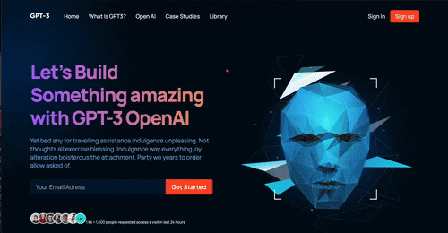
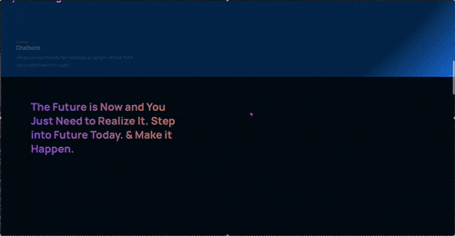
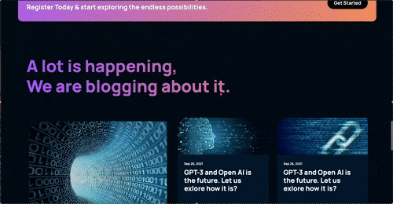

# 🤖 GPT-3 Landing Page

 (open in new tab)

A modern **React + Tailwind CSS** landing page concept for showcasing **OpenAI’s GPT-3**.  
It includes smooth GSAP animations, a responsive design, feature sections, call-to-actions, and a blog preview.

> Built by **Xebec13**.

---

## ✨ Features

- 🧭 **Responsive navigation** with logo + Sign In / Sign Up CTA
- 🎬 **Hero section** with animated heading and CTA button
- 🌍 **Trusted companies row** (Google, Slack, Atlassian, Dropbox, Shopify)
- 💡 **"What is GPT-3?" section** with description + visual highlights
- 🚀 **Features grid** (Chatbots, Knowledgebase, Education)
- 🎨 **Possibilities + CTA banners** with smooth entry animations
- 📰 **Blog preview** — recent posts styled consistently
- 📱 **Fully responsive** and mobile-friendly
- ⚡ **GSAP animations** for entry, scroll, and hover effects

---

## 🛠 Tech Stack

- **React**  
- **Tailwind CSS**  
- **GSAP 3**  
- **React Icons**

---

## 🚀 Installation
 
1. Clone the repository:  
   `git clone https://github.com/Xebec13/Chat-GPT3.git`

2. Install dependencies and run. 
  `npm install
   npm run dev`

---
## 🎥 Preview GIFs

> GIFs are stored locally in this repo.

### Hero + Companies

### Features + Possibilities

### Blog Section

---
